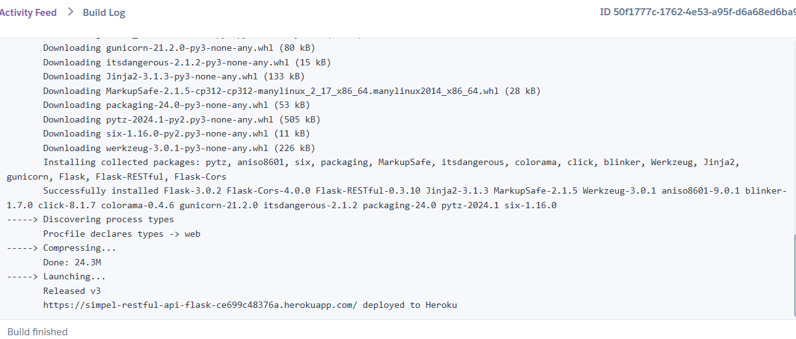

# Simpel RestAPI Flask
This project is a simple REST API built with Flask and deployed on Heroku.

## Deployment

The API is deployed on Heroku at the following URL:
```
https://simpel-restful-api-flask-ce699c48376a.herokuapp.com
```


## Features

- CRUD operations for user management.

## Technologies

- Flask
- Flask-SQLAlchemy
- Flask-MySQLdb
- Flask-Marshmallow
- Heroku

## Installation

To run this project locally, follow these steps:

1. Clone the repository.
2. Install the required dependencies using `pip install -r requirements.txt`.
3. Run the Flask server with `python app.py`.

## Usage

The API provides the following endpoints:

- `POST /users` - Create a new user.
- `GET /users` - Retrieve all users.
- `GET /users/<id>` - Retrieve a user by ID.
- `PUT /users/<id>` - Update a user by ID.
- `DELETE /users/<id>` - Delete a user by ID.


